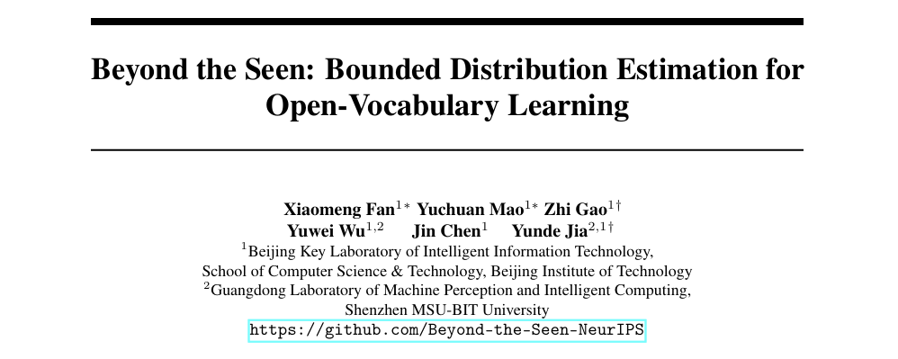

# Beyond the Seen: Bounded Distribution Estimation for Open-Vocabulary Learning

# **🔥NeurIPS 2025 (Poster)**

 

<p align="center">
  <a href="https://github.com/Beyond-the-Seen-NeurIPS/Beyond-the-Seen">
    
  </a>
  <a href="https://arxiv.org/abs/2510.04770">
    
  </a>
</p>

<p align="center">
  📄 <a href="https://arxiv.org/pdf/2510.04770">Paper</a>  
<!--   🚦 <a href="#quickstart">Quick Start</a> -->
</p>

### Performance Highlights (Baseline: PromptSRC)

#### Base-to-New:

| Name      |       Base        |        New        |         H         |
| --------- | :---------------: | :---------------: | :---------------: |
| CLIP      |       69.34       |       74.22       |       71.70       |
| CoOp      |       82.69       |       63.22       |       71.66       |
| CoCoOp    |       80.47       |       71.69       |       75.83       |
| DePT      |       85.19       |       76.17       |       80.43       |
| TCP       |       84.13       |       75.36       |       79.51       |
| CuTCP     |       84.21       |       76.10       |       79.95       |
| DeKg      |       84.96       |       76.38       |       80.44       |
| PromptSRC |       84.26       |       76.10       |       79.97       |
| Ours      | **86.40 (+2.14)** | **80.52 (+4.42)** | **83.36 (+3.39)** |

#### Cross-dataset:

| Name      |    Source     |      Target       |
| --------- | :-----------: | :---------------: |
| CoOp      |   **71.51**   |       63.88       |
| CoCoOp    |     71.02     |       65.74       |
| ASPrompt  |     71.05     |       67.03       |
| PromptSRC |     71.27     |       65.81       |
| Ours      | 71.22 (-0.05) | **67.68 (+1.87)** |

# 🛠️ Setup

## Install environment

```
# Create a conda environment
conda create -n beyond python=3.9.18 -y

# Activate the environment
conda activate beyond

# Install torch (requires version >= 1.8.1) and torchvision
# Please refer to https://pytorch.org/ if you need a different cuda version
pip install torch==2.1.2 torchvision==0.16.2 torchaudio==0.11.0

# Install requirements
pip install -r requirements.txt
```

## Prepare datasets

Please follow the instructions at [DATASETS.md](docs/DATASETS.md) to prepare all datasets.

## Prepare models

### (1) LLaVA

Refer to official [repo](https://github.com/haotian-liu/LLaVA) for environment setup.

After setting up the environment, you can download [checkpoints](https://github.com/haotian-liu/LLaVA/blob/main/docs/MODEL_ZOO.md) and add the model path to generate captions of seen-class data.

```
# sample.py
model_path = '/path/to/llava-v1.6-vicuna-13b'
```

### (2) Doubao

Refer to official API [documentation](https://www.volcengine.com/docs/82379/1399008) for environment setup.

After setting up the environment, you can export your own API key to generate candidate unseen classes.

Alternatively, you can implement your own API request function in `sample.py`.

### (3) Llama

Download [checkpoints](https://github.com/haotian-liu/LLaVA/blob/main/docs/MODEL_ZOO.md) and add the model path to generate captions of unseen-class data.

```
# sample.py
model_id = "/path/to/Llama-3.1-8B-Instruct"
```

### (4) Stable Diffusion

Download [checkpoints](https://huggingface.co/stabilityai/stable-diffusion-2-1/tree/main) and add the model path to generate unseen-class data.

```
# sample.py
sd_model = StableDiffusionPipeline.from_pretrained(
	"/path/to/stable-diffusion-2-1", variant="fp16", torch_dtype=torch.float16
)
```

### (5) Boosting prompt

Download the [checkpoints](https://pan.baidu.com/share/init?surl=OkWiRnnTmXg6mJrECjuVzQ&pwd=5tbr) related to the boosting prompt and add the model path.

```
# scripts/caspl/beyond/base2new_train_beyond_student.sh
# scripts/caspl/beyond/base2new_test_beyond_student.sh
MODEL_DIR=/path/to/teacher/...
```

# Experiments

### (0) Generate unseen-class data

Prepare the prompts used to generate unseen-class data. We’ve provided an example in `prompt.py`.

Add data paths and output paths.

```
# train_script/caspl_beyond/train_base_to_new.py
dataset_list = [ 'caltech101', ... ]

# scripts/caspl/beyond/base2new_train_beyond_student.sh
# scripts/caspl/beyond/base2new_test_beyond_student.sh
DATA=/path/to/dataset/folder
DIR=/path/to/output/...
KD.RESULT_PATH /path/to/output/...

# train.py
cfg.FUTURE.candidate_data_root = '/path/to/generated_data'
```

Run the script below and exit after the `generate_candidate_data` function.

```
python train_script/caspl_beyond/train_base_to_new.py
```


### (1) Base-to-Novel Experiments

Add data paths and output paths and run the script below.

```
python train_script/caspl_beyond/train_base_to_new.py
```

### (2) Cross-dataset Experiments

Add data paths and output paths and run the script below.

```
python train_script/caspl_beyond/train_cross_dataset.py
```

# Acknowledgement

Thanks for their brilliant contributions to the community! Here are the codebases we built upon.

* https://github.com/megvii-research/CasPL
* https://github.com/muzairkhattak/multimodal-prompt-learning
* https://github.com/KaiyangZhou/CoOp

# Citation

If you find our work helpful, please consider cite our paper 📝 and star us ⭐️！

```bib
@inproceedings{Fan2025beyond,
    title={Beyond the Seen: Bounded Distribution Estimation for Open-Vocabulary Learning},
    author={Xiaomeng Fan and Yuchuan Mao and Zhi Gao and Yuwei Wu and Jin Chen and Yunde Jia},
    booktitle={Advances in Neural Information Processing Systems},
    year={2025}
}
```
